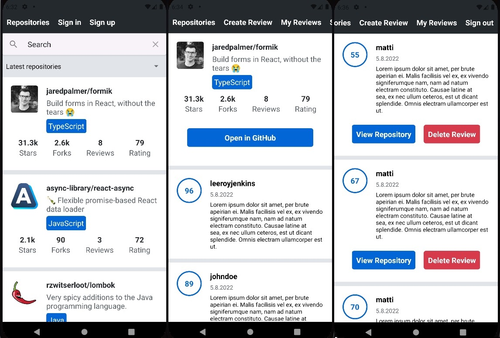

# Rate Repository App (front end)
Developed during [Full Stack Open part 10 React Native course](https://fullstackopen.com/en/part10). Frontend communicates with server via GraphQL.

## Key features:
- Account creation
- Viewing repositories
- Sorting repositories by date or rating
- Filtering repositories with text search
- Writing a review for a repository
- Deleting a review 

Course provided the [back end](https://github.com/fullstack-hy2020/rate-repository-api).

